# Fund KIS' immutable React-based charts library

This is a work of [Fund KIS](http://fundkis.com/lab/react-chart) to 
easily produce quality charts.

Those graphics are produce in the [SVG](https://www.w3.org/Graphics/SVG/)
format.

More exemples are available at [the Fund KIS github page](https://fundkis.github.io/reactchart).

## Dependencies

This library is based on [React](http://facebook.github.io/react/)
and [Freezer](https://github.com/arqex/freezer).

## Installation

Using ```npm``` and the npm registry,
```
npm install reactchart
``` 
If you wish to use directly the sources:

###### using ```git```:
you'll need to clone the repo
```
git clone git@github.com:fundkis/reactchart.git
```
in some place ```node``` can reach (either locally in your
*node_modules* folder or in the ```NODE_PATH``` folder, if
set), then you'll need to delete the ```.git``` folder.

###### Using ```npm```:
```
npm install git+ssh://git@github.com/fundkis/reactchart.git
```

## Usage

Let's start with a minimal example:

```
let React = require('react');
let Chart = require('reactchart');

let props = {
	width: 600, // px
    height: 300, // px
    data: [{
    	series: [
        	{x: 0, y: 1},
        	{x: 1, y: 2},
        	{x: 2, y: 2},
        	{x: 3, y: 3},
        	{x: 4, y: 2.5},
        	{x: 5, y: 4},
        	{x: 6, y: 1}
    	]
    }],
    graphProps: [{color: 'blue'}]
};

class ShowChart extends React.Component {

	render(){
    	return <div>
        	<h1>My first graph!</h2>
            <Chart {...props}/>
        </div>;
    }
}

```
The above example produces this chart:


Then all the subtlety consists in knowing how to use the props.

### Proprieties you should know about

The very least you need to do is to provide a _width_, a _height_,
some _data_ and _graphProps_. The data you wish to render
are the _series_ in the _data_ part, while the way you
wish to see them will be in the _graphProps_ part.

#### The _data_

The _data_ proprieties contains the numerical description of the
graphic, basically what should be shown. It is an array as one
graphic may contain several data.

```
data: [{
	series: [{x, y, value, label: {x, y}, tag, legend		}], // the data points
    type: 'Plain' or 'Bars' or ..., // type of graph
    stacked: undefined or x or y, // should the data be stacked along a direction
    ord: {
    	axis: 'left' or 'right', // which axis
        type: 'number' or 'date', // type of y data
    },
    abs: {
		axis: 'bottom' or 'top',
        type: 'number' or 'date'
	}
}, ...
]
```
##### Default settings and type of chart

The first piece of information to provide is the data points. The simplest
form is ```{x, y}``` with the values being either a number or a date. The _label_ enables
to print labels instead of values at the axis' corresponding tick.

The library can handle numbers and dates as input values, a date should be explicitely
declared in the corresponding proprieties (_abs_ if abscissa or _ord_ if ordinate).

Once you have some data, you get to choose which type of chart will give them the best
justice! Here are the same data, rendered by the default settings, changing the
_type_ value. The stairs can be either _left_ or _right_.

```Bars```: 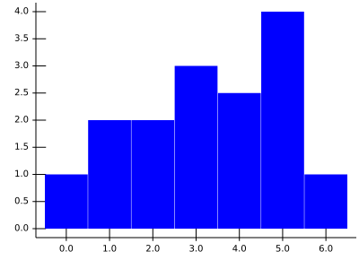
```yBars```: 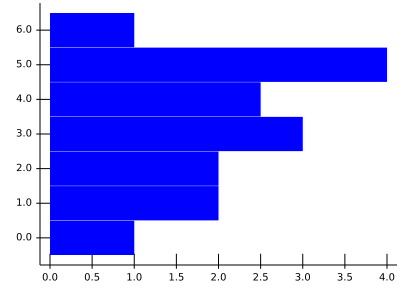
```Pie```: 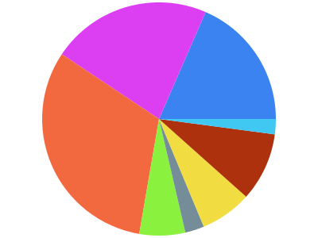
```Stairs```: 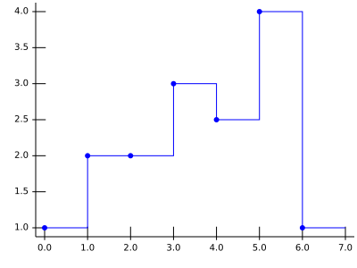
```Stairs```: 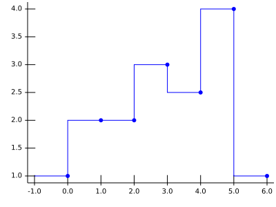

##### Stacking

It is possible to stack values. Each stacked-declared serie will be offsetted
so as to "sit" on the stack. You probably want _bar_ marks, and no line. The
_stacked_ parameter takes a string giving the direction of the stacking:

 Direction | Prop | Chart |
:---: | :--:           | :--:
x     | `stacked: 'x'` | 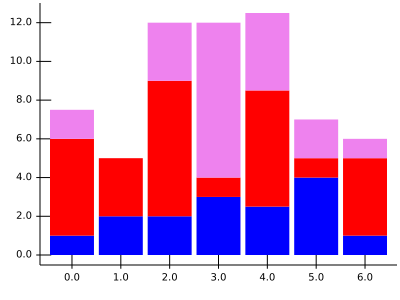
y     | `stacked: 'y'` | 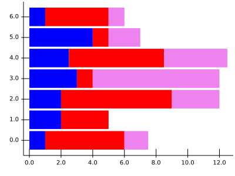

##### The axis

An axis can be a _date_  or a _number_ axis. As dates are not numbers, the library
shows period instead of milestone, unless the period is very short.

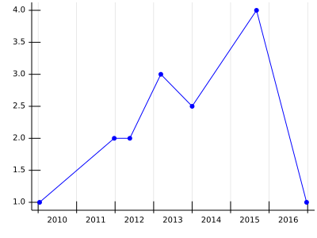

The axis against which the data should be plotted
can be _left_ or _right_, _top_ of _bottom_, providing the correct
[axis definition](https://github.com/fundkis/reactchart/#the-axis-description-axisprops).

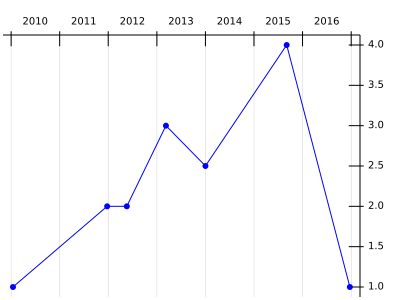
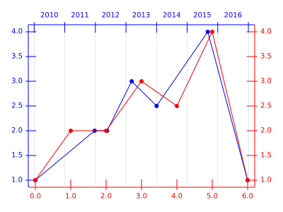

#### The _graphProps_

This contains the description of how the data should be printed. When there are
several values, the first value given is the default value.

Note that in most browsers, an **undefined** color is equivalent to black.

```
graphProps: [{
	color: 'black' or 'blue' or '#1F456C' or ..., // any color
	width: 1, // any number
	fill: 'none' or 'blue' or ..., // any color or 'none'
	shade: 1, // any number between 0 and 1
    dropLine: {x: false or true, y:false or true}, // draw?
	// mark props, explicit at this level
	// overwritten if present in markProps
	// exists for friendlyness of use
	mark: true or false, // print marks ?
	markColor: undefined, // any color
	markSize: 3, // 
	markType: 'dot' or 'square', //
	onlyMarks: false, //
	// contains low-level description,
	// i.e. specific things like radius
	// for a dot, or anything.
	markProps: {},
	shader: undefined, // playing with colors
	tag: {
		show: false, // show the tag
		print: (t) => t + '', // if something special needs to be done
		fontSize: 10, // any number
		pin: true or false, // show the pin
    	pinColor: 'black', 
		pinLength: 10, // 10 px as pin length by default
		pinAngle: 90, // direction fo pin
		pinHook: 3
	}
}, ...
]
```
The details of the _marksProps_ are given at the [marks](https://github.com/fundkis/reactchart/#the-different-marks) section, 
the _shader_ at the [shading](https://github.com/fundkis/reactchart/#playing-with-color) section.

##### Basic

The basic proprieties are the color (_color_), the width of the line (_width_), the opacity of
the charts (_shade_) and wether or not the area under the curve should be colored (_fill_).

##### dropLine

The _dropLine_ boolean is used to print the drop lines.

##### The marks controller at high level

A few mark controllers are available at this level of description. The most common ones:
  - should the mark be printed? _mark_;
  - the color of the marks: _markColor_;
  - the type of mark: _markType_;
  - the size of the marks: _markSize_.

The different types available are currently _dot_, _square_ and _bar_.
Note that the size has a different meaning for different marks. For more details, see the
[description of the marks](https://github.com/fundis/reactchart/#the-different-marks).

##### shader

The _shader_ enables fine color control of the marks, it has three calculations type, see
the [shading section](https://github.com/fundkis/reactchart/#playing-with-color) for more
details.

##### Tag the data

You can tag any data point you wish. Note that tagging is a 
[complex issue](https://en.wikipedia.org/wiki/Automatic_label_placement), and it is not
in the [FundKIS](https://fundkis.com/) TODO list to start research in this area. Thus
labelling is kept at it's most basic form: you describe a tag (called pin) with its
length, angle, and hook. The tag itself is given by a _tag_ propriety in the data point.

#### The axis' description: _axisProps_

React Chart supports two possible axis for the abscissa and the ordinate: at the
top of the bottom of the chart for the abscissa, left or right for the ordinate.
Thus the following description:
```
{
	ticks: {
		major: {
        	color: 'black' or 'blue' or '#F13ED5" or..., 
            show: true or false, 
            labelColor: 'black' or 'blue' or '#F13ED5" or...
        },
        minor: {
        	color: 'black' or 'blue' or '#F13ED5" or..., 
            show: true or false, 
            labelColor: 'black' or 'blue' or '#F13ED5" or...
        },
	},
	grid: {
		major: {
        	color: 'lightgrey' or ...,
            show: false or true
        },
		minor: {
        	color: 'lightgrey' or ...,
            show: false or true
        },
	},
	show: true,
	// to force definition
	min: undefined,
	max: undefined,
	tickLabels: [], //{coord: where, label: ''}, coord in ds
	color:     'black',
	width:      1,
	label:      '',
	empty:      false
}
```
An axis is composed of the axis line, the ticks and the grid. The ticks and the
grid can be _major_ or _minor_. A tick is composed of a line and a label
placed near it.

All of these different parts have a _color_ and a _show_ proprieties. The axis can
be forced to a minimum (_min_) and a maximum (_max_) value.

You can provide a _label_ to your axis, and have only a line using the _empy_ boolean.

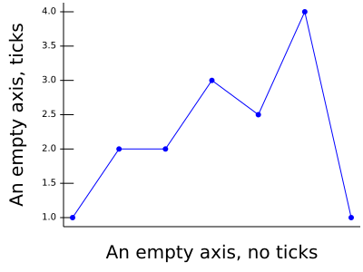

### The different graphics' type

As shown in [the first section](https://github.com/fundis/reactchart/#default-settings-and-type-of-chart), you have:
  - _Plain_
  - _Bars_
  - _yBars_
  - _Stairs_
  - _Pie_

Stairs can be either _right_ or _left_ using the propriety _stairs_ in the
_graphProps_ propriety.


### The different marks

As of now, React Chart supports _dot_, _square_, _opendot_ and _opensquare_ using the _markType_ propriety.
The _markSize_ propriety refers to the radius of the dot and the width of the square.

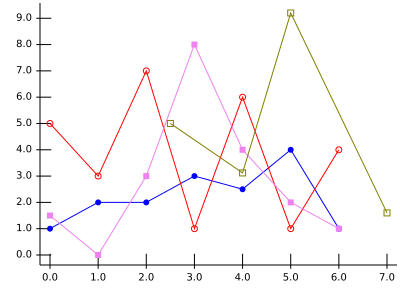

### Playing with the colors

Marks color or opacity can be evaluated and computed for each point.   

### Some more playabilities (background, foreground)
### Immutability and optimisation

